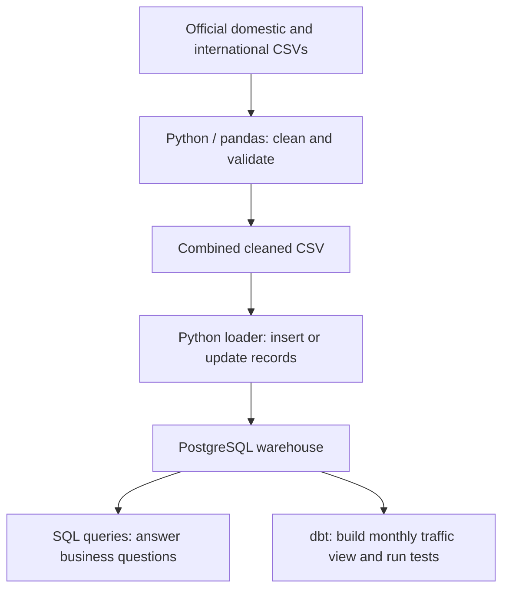
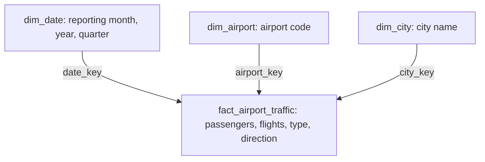
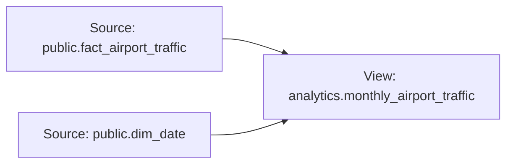

# Dammam Airport Traffic Warehouse

An end-to-end data engineering project that turns official Dammam Airport CSV files into a validated PostgreSQL warehouse for traffic analysis.

The source files contain inconsistent text, numeric values stored as text, and missing passenger counts. This project cleans those issues, preserves missing values, and makes the data usable for questions about monthly trends, domestic versus international traffic, and the busiest cities.

**Scope:** 2,479 traffic records · January 2024–October 2025 · 68 cities

**Tools:** Python · pandas · PostgreSQL · SQL · dbt · Jupyter Notebook

## Pipeline



The notebook records the investigation and cleaning decisions. The two Python scripts make those steps repeatable. dbt uses the loaded warehouse to create a reusable monthly summary and check its data.

## Dataset and cleaning

The dataset covers January 2024–October 2025. Each row summarizes one airport, reporting month, flight type, direction, and partner city. These are monthly traffic counts, not individual flights or unique travelers.

- 2,479 records: 674 domestic and 1,805 international.
- 22 reporting months, one airport, and 68 distinct cleaned cities.

| Source issue | Cleaning decision |
| --- | --- |
| Introductory lines and empty columns | Skip the first three lines and remove empty columns |
| Published totals mixed with detail rows | Separate totals and use them to validate the cleaned data |
| Spaces and inconsistent names | Trim text and standardize known errors such as `Departue` and `Bagdad` |
| Passenger and flight counts stored as text | Remove formatting and convert to integers |
| 16 missing international passenger values | Preserve them as missing values, then SQL `NULL` |

Validation checks cover duplicate business keys, required fields, positive reported counts, and agreement with both source totals.

The first day of each `date` represents a reporting month. Passenger sums exclude missing values. Not every city necessarily has a record for every month, and 2025 is a partial year.

## Business questions

[sql/queries.sql](sql/queries.sql) answers four questions:

1. How does traffic change each month?
2. How do domestic and international totals compare?
3. Which cities have the most passenger traffic?
4. How do arrivals and departures compare by flight type?

| Flight type | Reported passengers | Flights |
| --- | ---: | ---: |
| Domestic | 11,557,402 | 83,949 |
| International | 11,652,478 | 84,828 |

These totals match the source CSVs. Across the supplied period:

- **July 2025** has the highest reported passenger total: **1,244,059**.
- **August 2025** has the most flights: **8,480**.
- **Jeddah** and **Riyadh** lead city passenger traffic, with **4,303,973** and **3,001,225** respectively, combining arrivals and departures.

## Warehouse design

The main fact table stores passenger and flight counts. Three dimension tables provide the reporting month, airport, and city. This layout is called a **star schema**.



Each fact row represents one airport, month, city, flight type, and direction. A unique constraint prevents duplicate records at this level.

## dbt: monthly summary and lineage

The dbt view, `analytics.monthly_airport_traffic`, joins the fact and date tables and aggregates counts by month. Three tests check that the month is present and unique and the flight total is present.

The two existing warehouse tables are declared as **sources** in `dbt/models/schema.yml`. The model uses `source()` to reference them, allowing dbt to track where its data comes from. The arrows below show these dependencies (lineage).



Python loads the source tables; dbt builds the summary view.

## Files

```text
data/raw/                              Original CSVs and metadata
data/processed/                        Generated clean CSV
notebooks/01_data_exploration.ipynb     Investigation and cleaning decisions
python/clean_airport_traffic.py         Repeatable cleaning and validation
python/load_airport_traffic.py          PostgreSQL loader
sql/schema.sql                         Tables and constraints
sql/queries.sql                        Four business questions
dbt/dbt_project.yml                    Model configuration
dbt/profiles.yml                       Connection settings
dbt/models/                            Source definitions, monthly view, and tests
docs/data_sources.md                   Attribution and cleaning notes
```

## Run locally

Tested with Python 3.11, PostgreSQL 18, dbt Core 1.12.4, and dbt-postgres 1.11.0. Run terminal commands from the project's main folder.

### 1. Set up Python

```powershell
python -m venv .venv
.\.venv\Scripts\python.exe -m pip install -r requirements.txt
```

For exploration, open the notebook in VS Code and select the project `.venv` kernel. Its relative paths expect `notebooks` as the working folder. Restart the kernel and run all cells for a fresh run.

### 2. Clean the data

Keep the two original CSVs in `data/raw/` with their original filenames. Download links are in [docs/data_sources.md](docs/data_sources.md).

```powershell
.\.venv\Scripts\python.exe python/clean_airport_traffic.py
```

Expected result: 2,479 rows in `data/processed/dammam_airport_traffic_clean.csv`. Validation counts apply to this source snapshot.

### 3. Set up PostgreSQL

In pgAdmin, create `dammam_airport_warehouse`. Open its Query Tool and run `sql/schema.sql` once against the empty database.

Copy `.env.example` to `.env` and fill in your local database credentials. `.env` is excluded from Git.

### 4. Load and query

```powershell
.\.venv\Scripts\python.exe python/load_airport_traffic.py
```

Expected counts: `dim_date` 22, `dim_airport` 1, `dim_city` 68, and `fact_airport_traffic` 2,479. The fact table references each dimension using its generated key.

The loader inserts new records and updates counts for matching business keys. Repeated runs do not duplicate the same records. It does not remove records absent from a later CSV.

Run `sql/queries.sql` in pgAdmin for the business questions.

### 5. Build the dbt view and test it

```powershell
.\.venv\Scripts\dbt.exe build --project-dir dbt --profiles-dir dbt
```

The pinned dbt version reads `.env` from the project folder. It creates `analytics.monthly_airport_traffic` and checks that reporting months are present and unique and flight totals are present.

In pgAdmin:

```sql
SELECT *
FROM analytics.monthly_airport_traffic
ORDER BY reporting_month;
```

## Attribution

Data: [Dammam Airports / King Fahd International Airport Open Data](https://kfia.sa/open-data), subject to the publisher's reuse terms. Raw files are preserved; cleaned outputs are derived data. This is an independent learning project.
